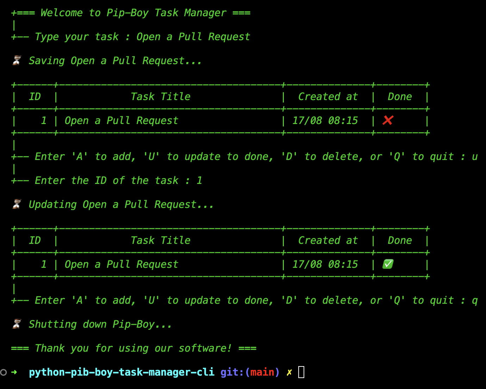

# python-pip-boy-task-manager-cli

A simple terminal-based task management tool inspired by the iconic Pip-Boy from the Fallout series.

Manage your daily tasks with a retro flair, all within your command line.

## App Preview


### Running the Application :
```bash
python3 main.py
```
